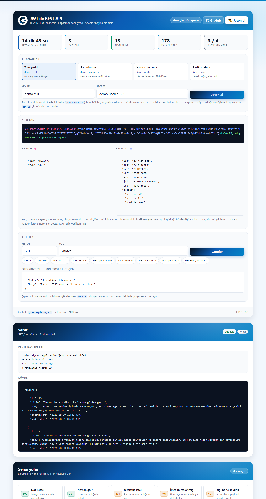
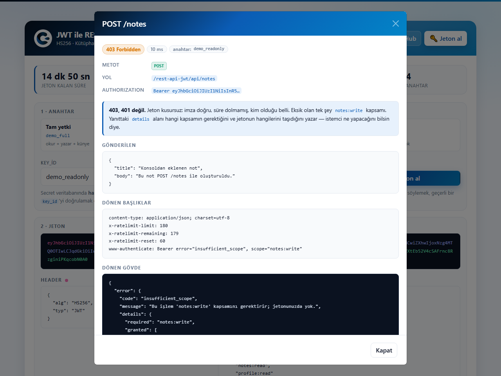
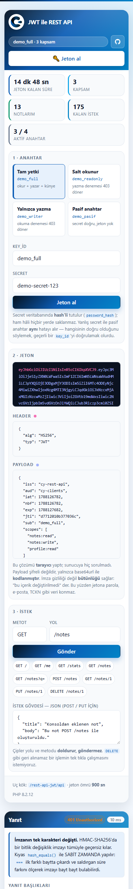

<div align="center">


# JWT ile REST API

### PHP 8 · HS256 · Kütüphanesiz · Kapsam Tabanlı Yetki · Bootstrap 5 · Çılgın Yazılım Tasarım Kalıbı

**Composer yok, firebase/php-jwt yok — 60 satır PHP. Ama doğru yapılmış hâli.**

[](https://php.net)
[](https://mysql.com)
[](https://jwt.io)
[](#kurulum)
[](LICENSE)

**🇹🇷 Türkçe** · [🇬🇧 English](README.en.md)

[**▶ Canlı Demo**](https://cilginyazilim.com/kutuphane/uygulama/rest-api-jwt/) · [Kaynak Kütüphanesi](https://cilginyazilim.com/kutuphane/php-rest-api-jwt) · [cilginyazilim.com](https://cilginyazilim.com)

</div>

---

<div align="center">

## Canlı Demo

**Kurulum yok, kayıt yok, indirme yok — tarayıcınızdan 3 saniyede deneyin.**

<a href="https://cilginyazilim.com/kutuphane/uygulama/rest-api-jwt/"></a>
<a href="https://cilginyazilim.com/kutuphane/php-rest-api-jwt"></a>
<a href="https://github.com/CilginYazilim/rest-api-jwt/archive/refs/heads/main.zip"></a>

<br><br>

<a href="https://cilginyazilim.com/kutuphane/uygulama/rest-api-jwt/" title="Canlı demoyu açmak için tıklayın">
  
</a>

<sub>▲ Görsele tıklayarak demoyu açabilirsiniz</sub>

</div>

<br>

### Demoda 60 saniyede neleri deneyebilirsiniz?

| # | Şunu deneyin | Perde arkasında ne oluyor? |
|---|--------------|----------------------------|
| **1** | Sağ üstteki **🔑 Jeton al** düğmesine basın | `POST /auth/token` çağrılır. `secret` veritabanındaki **hash** ile `password_verify()` üzerinden kıyaslanır; ham secret hiçbir yerde durmaz. Yanıt kısa ömürlü bir JWT'dir |
| **2** | **2 · Jeton** bölümündeki üç renkli parçaya bakın | Bir JWT `header.payload.signature`'dır. Payload **tarayıcıda** çözülür — sunucuya hiç sorulmadan. Çünkü şifreli değildir, yalnızca base64url ile **kodlanmıştır** |
| **3** | Payload'daki `exp` ve `scopes` alanlarını okuyun | `exp` jetonun son kullanma anı, `scopes` ise **yetki**. Kimlik ile yetkinin ayrı şeyler olduğunu tek ekranda gösteren yer burası |
| **4** | **Salt okunur** anahtarını seçip yeniden jeton alın, sonra `POST /notes` gönderin | **403 `insufficient_scope`.** Jeton kusursuz: imza doğru, süre dolmamış. Eksik olan tek şey `notes:write` kapsamı |
| **5** | **Yalnızca yazma** anahtarıyla `GET /notes` deneyin | Yine **403**. "Yazabiliyorsa okuyabilir" diye bir kural yoktur; kapsamlar birbirini kapsamaz |
| **6** | **Pasif anahtar** ile jeton almayı deneyin | **401.** Sunucu "secret yanlış" ile "anahtar pasif" arasındaki farkı **söylemez** — söyleseydi geçerli bir `key_id`'yi doğrulamış olurdu |
| **7** | Senaryolardan **alg: none saldırısı**na basın | Tarayıcı kendi jetonunu uydurur: `alg` = `none`, imza bölümü boş. API onu **imza hiç hesaplanmadan** reddeder |
| **8** | **İmza kurcalanmış** senaryosunu çalıştırın | Geçerli bir jetonun imzasının tek karakteri değişti. HMAC'te bir bitlik fark imzayı tümüyle geçersiz kılar |
| **9** | **Süresi dolmuş jeton** ve **Başka servisin jetonu** senaryolarını çalıştırın | İkisinin de **imzası geçerlidir**. Biri `exp`ten, diğeri `aud`dan düşer — imza doğrulaması tek başına yetmez |
| **10** | Sayaç şeridindeki **Kalan istek** kutusunu izleyin | `X-RateLimit-Remaining` **başlığından** okunur. Sayaç anahtar başınadır ve kayan pencereyle çalışır |
| **11** | Geçmişteki bir satıra tıklayın | Gönderilen başlıklar, gövde, dönen başlıklar ve **curl karşılığı** tek ekranda. Adres çubuğu `#detay-yetkisiz-yazma` olur — **paylaşılabilir** |

> **İpucu:** Demoyu açıkken **F12 → Network** sekmesini açın. Bu sayfanın sunucuyla tek bağı `/api/...` istekleridir; `Authorization: Bearer …` başlığını ve `X-RateLimit-*` yanıt başlıklarını canlı görebilirsiniz. Aynı istekleri terminalden curl ile atarsanız **aynı** cevapları alırsınız — API tarayıcıya bağlı değildir.

### Demo alanı hakkında bilinmesi gerekenler

| Konu | Durum |
|------|-------|
| **Anahtarlar** | `cy_api_jwt.sql` içindeki **dört anahtar**, dört farklı yetki durumunu temsil eder: tam yetki, salt okunur, yalnızca yazma, pasif. Secret'lar bilerek herkese açıktır — burası bir demo. |
| **Veriler** | **19 not**, üç anahtara dağılmış. Her anahtar yalnızca **kendi** notlarını görür; başkasının notu listede görünmez, id ile istendiğinde de `404` döner. |
| **Sıfırlama** | Demo veritabanı **düzenli aralıklarla** başlangıç hâline döner; sildiğiniz notlar geri gelir. |
| **Jeton ömrü** | **900 saniye (15 dk).** Sayaç şeridinde geri sayar; son 60 saniyede uyarı rengine geçer. |
| **`DEMO_TOKENS`** | Demoda **açık**: `/auth/demo-token` bilerek bozuk jetonlar üretir. Kendi kurulumunuzda **kapatın** (bkz. [Yapılandırma](#yapılandırma)). |
| **`APP_DEBUG`** | Canlıda **otomatik `false`** — sunucu adından türetilir, yerelde `true` kalır. |
| **Bağımlılık** | **Sıfır.** Composer yok, npm yok, JWT kütüphanesi yok. |

> Demo geçici olarak kapalıysa endişelenmeyin: depoyu klonlayıp `cy_api_jwt.sql`'i içe aktarmanız aynı ekranı kendi bilgisayarınızda **2 dakikada** ayağa kaldırır → [Kurulum](#kurulum)

---

## Bu Proje Nedir?

Bir mobil uygulama, bir SPA ya da başka bir servis, sizin veritabanınızdaki veriye erişecek. Oturum çerezi kullanamıyorsunuz — çerez tarayıcıya aittir, mobil uygulamaya değil. Cevap bilinir: **jeton tabanlı API.**

Sorun, jetonun kendisini yazmaktır. İnternetteki çoğu örnek şunu yapar:

```php
// Kütüphaneden gelen "kolay" kullanım
$claims = JWT::decode($token, $key, ['HS256', 'RS256', 'none']);
if ($claims->user_id) { /* içeri al */ }
```

Bu üç satırda **üç ayrı açık** var:

1. `none` algoritmasına izin verilmiş → saldırgan imzayı silip payload'ı istediği gibi yazar
2. `exp` hiç kontrol edilmemiş → çalınan jeton **sonsuza dek** geçerli
3. Kimlik ile **yetki** karıştırılmış → jetonu olan herkes her şeyi yapabiliyor

Bu proje o üç soruyu ve bir API'nin diğer beş zor sorusunu cevaplıyor — hepsi **kütüphanesiz**, yaklaşık 60 satırlık bir `jwt_encode` / `jwt_decode` çiftiyle:

1. **Jeton kurcalanırsa?** → `hash_equals()` ile sabit zamanlı HMAC doğrulaması
2. **`alg: none` gelirse?** → algoritma jetondan okunmaz, **sabittir**
3. **Jeton çalınırsa?** → kısa ömür (`JWT_TTL`) + `iss`/`aud` kontrolü
4. **Jetonu olan her şeyi yapabilir mi?** → **kapsam (scope)** tabanlı yetkilendirme
5. **Secret veritabanından sızarsa?** → secret **hash'li** tutulur (`password_hash`)
6. **Biri uçları döverse?** → anahtar başına kayan pencereli hız sınırı
7. **İstemci hatayı nasıl anlar?** → değişmeyen `error.code` ile **tutarlı** JSON zarfı
8. **Başkasının kaydını isterse?** → sahiplik koşulu **her sorgunun** `WHERE`'inde

**Kimler için uygun?**

- Mobil uygulaması ya da SPA'sı için API yazacaklar
- JWT'yi kütüphane arkasında değil, **içini görerek** öğrenmek isteyenler
- `401` ile `403` arasındaki farkı doğru kurmak isteyenler
- Kapsam (scope) tabanlı yetkilendirmeyi ilk kez kuracaklar
- Paylaşımlı hostingde çalışan ve Composer kullanamayanlar
- Bootstrap 5 üzerine kurulu, tekrar kullanılabilir bir tasarım kalıbı arayanlar

> **Klonla, `cy_api_jwt.sql`'i içe aktar, çalıştır.** Başka hiçbir kurulum adımı yok. Composer yok, npm yok, internet bağlantısı bile gerekmiyor — tüm kütüphaneler proje içinde.

Bu proje, **[Çılgın Yazılım Kütüphanesi](https://cilginyazilim.com/kutuphane)** altında yayınlanan açıklamalı, üretime hazır örneklerden biridir.

---

## İçindekiler

- [Canlı Demo](#canlı-demo)
- [Bu Proje Nedir?](#bu-proje-nedir)
- [Ekran Görüntüleri](#ekran-görüntüleri)
- [Beş Kritik Karar](#beş-kritik-karar)
- [Neler Var?](#neler-var)
- [Güvenlik: Neyi, Nasıl Kapattık?](#güvenlik-neyi-nasıl-kapattık)
- [Kurulum](#kurulum)
- [Yapılandırma](#yapılandırma)
- [Kendi Projenize Eklemek](#kendi-projenize-eklemek)
- [Tasarım Kalıbı](#tasarım-kalıbı)
- [Dosya Yapısı](#dosya-yapısı)
- [Nasıl Çalışıyor?](#nasıl-çalışıyor)
- [API Referansı](#api-referansı)
- [Veritabanı Şeması](#veritabanı-şeması)
- [Sık Sorulanlar](#sık-sorulanlar)
- [Canlı Ortama Alırken](#canlı-ortama-alırken)
- [Sorun Giderme](#sorun-giderme)
- [Yol Haritası](#yol-haritası)
- [Katkı](#katkı)
- [Lisans](#lisans)

---

## Ekran Görüntüleri

### API konsolu

Jetonun üç parçası, çözülmüş header ve payload, uç nokta çağrısı ve yanıt — tek ekranda.


### İstek detayı

Gönderilen başlıklar, gövde, dönen başlıklar, dönen gövde ve **curl karşılığı**. Üstteki açıklama kutusu `403` ile `401` farkını tam o anda anlatır.



### Mobil görünüm

390px genişlikte **yatay kaydırma yok**. İkincil sütunlar gizlenir; bilgi detay penceresinde korunur.



---

## Beş Kritik Karar

### 1. Algoritma jetondan okunmaz

```php
// TİPİK HATALI KOD — algoritmayı saldırgan seçiyor
$header = json_decode(base64_decode($h64), true);
$alg = $header['alg'];               // "none" gelebilir!
if ($alg === 'none') { /* imza yok, geç */ }

// BU PROJEDE — algoritma SABİT
if (!is_array($header) || ($header['alg'] ?? '') !== 'HS256') {
    return [null, 'bad_alg'];        // imza HİÇ hesaplanmadan reddedilir
}
```

`alg: none` saldırısı gerçek kütüphanelerde yıllarca yaşadı ve bugün hâlâ kopyalanan örneklerde duruyor. Saldırgan `alg` değerini `none` yapar, imza bölümünü siler ve payload'a istediği `sub` ile `scopes` değerlerini yazar. Kod algoritmayı **jetonun kendisinden** okuyorsa, saldırganın kimliğini kendi kendine onaylamış olur.

Doğrusu, sunucunun hangi algoritmayı kabul ettiğini **önceden bilmesidir**. Demodaki "alg: none saldırısı" senaryosu bu jetonu tarayıcıda üretir ve reddedilişini gösterir.

### 2. İmza `hash_equals` ile kıyaslanır

```php
// TİPİK HATALI KOD
if ($expectedSig === $gelenSig) { /* ... */ }

// BU PROJEDE
if (!hash_equals($expectedSig, b64url_decode($s64))) {
    return [null, 'bad_signature'];
}
```

PHP'nin `===` operatörü dizeleri bayt bayt kıyaslar ve **ilk farklı baytta çıkar**. Kıyas süresi, kaç baytın tuttuğuna bağlı olarak değişir; bu fark ağ üzerinden bile ölçülebilir. Saldırgan imzayı bayt bayt tahmin ederek doğru olanı bulabilir.

`hash_equals()` uzunluktan bağımsız olarak **hep aynı süreyi** harcar. Bu, jeton doğrulamasının pazarlık edilemez parçasıdır.

### 3. Kimlik doğrulama ile yetkilendirme ayrı katmanlardır

```
Authorization: Bearer <jwt>
        │
        ├── require_auth()   → jeton geçerli mi?        değilse 401
        │                       (imza, exp, nbf, iss, aud)
        │
        └── require_scope()  → bu işlemi yapabilir mi?  değilse 403
                                (scopes claim'i)
```

**401 "kim olduğunu bilmiyorum" demektir; 403 "kim olduğunu biliyorum ama bunu yapamazsın" demektir.** İkisini karıştıran bir istemci 403 aldığında yeni jeton almaya çalışır, aynı 403'ü alır ve **sonsuz döngüye** girer.

Bu projede dört demo anahtarı bu ayrımı somutlaştırır: `demo_writer` yazabilir ama **okuyamaz**. "Yazabiliyorsa okuyabilir" diye bir kural yoktur.

### 4. Secret veritabanında hash'li tutulur

```sql
-- TİPİK HATALI ŞEMA
`secret` VARCHAR(64) NOT NULL,        -- ham secret; sızan döküm = ele geçen API

-- BU PROJEDE
`secret_hash` VARCHAR(255) NOT NULL,  -- password_hash(); geri üretilemez
```

API anahtarının secret'ı da bir paroladır — yalnızca kullanıcısı insan değil, bir programdır. Anahtar tablosu, sızdırılan veritabanı dökümlerinde ilk bakılan yerdir. Ham secret dursaydı, dökümü ele geçiren herkes API'ye tam yetkiyle girerdi.

Doğrulama `password_verify()` ile yapılır ve **anahtar bulunamasa bile çalıştırılır**: yoksa "bu `key_id` var ama secret yanlış" ile "bu `key_id` hiç yok" arasındaki süre farkı ölçülebilir hâle gelirdi.

### 5. Sahiplik koşulu SQL'dedir, PHP'de değil

```php
// TİPİK HATALI KOD — bir yerde unutulur
$not = $db->query("SELECT * FROM api_notes WHERE id = $id")->fetch();
if ($not['owner_key'] !== $claims['sub']) { /* 403 */ }

// BU PROJEDE — unutmak İMKÂNSIZ
$stmt = $db->prepare('SELECT … FROM api_notes WHERE id = :id AND owner_key = :k');
```

Sahiplik kontrolünü PHP'ye bırakmak, beş uç noktadan birinde unutulması demektir — ve o bir uç, bütün verinin sızması için yeter. Koşul `WHERE`'e gömülünce kontrol atlanabilir bir adım olmaktan çıkar.

Bir ayrıntı daha: yetkisiz kayıt için **403 değil 404** dönüyoruz. 403, "böyle bir kayıt var ama senin değil" bilgisini verirdi; o bilgi, başkasının kaç kaydı olduğunu saymaya yarar.

---

## Neler Var?

<table>
<tr><td width="50%" valign="top">

**JWT çekirdeği (kütüphanesiz)**
- HS256 imza, `hash_hmac` + `hash_equals`
- `alg` sabit — `none` ve algoritma karışıklığı kapalı
- `exp`, `nbf` kontrolü `JWT_LEEWAY` toleransıyla
- `exp`i olmayan jeton **reddedilir**
- `iss` / `aud` doğrulaması
- `jti` (jeton kimliği) baştan bulunur
- base64url encode/decode elle yazılmış

**Kimlik ve yetki**
- API anahtarı → kısa ömürlü jeton akışı
- `secret` `password_hash()` ile saklanır
- Zamanlama saldırısına karşı sahte hash ile doğrulama
- Anahtar sayımına (enumeration) karşı tek tip hata
- Kapsam (scope) tabanlı yetkilendirme
- Kapsamlar **beyaz listeden** geçer
- `active = 0` ile anahtarı silmeden kapatma

</td><td width="50%" valign="top">

**API tasarımı**
- Tutarlı JSON zarfı: `data` / `meta` / `error`
- Değişmeyen `error.code` + insan için `error.message`
- Doğru durum kodları: 200/201/204/400/401/403/404/405/422/429/500
- `Allow`, `Location`, `WWW-Authenticate`, `Retry-After` başlıkları
- Sayfalama, arama (`?q=`), sıralama (beyaz listeli)
- Anahtar başına **kayan pencereli** hız sınırı
- `GET /` ile uç listesi (discovery)
- CORS + preflight (`OPTIONS` → 204)

**Konsol ve tasarım**
- Jetonun üç parçası renkli, payload tarayıcıda çözülür
- **8 senaryo**: doğrulamayı bilerek kıran istekler
- İstek geçmişi + detay penceresi + **curl karşılığı**
- Paylaşılabilir derin bağlantı (`#dene-…`, `#detay-…`)
- Sayaç şeridi: kalan süre, kapsam, not, kalan istek, anahtar
- Mobil: 360px'te **yatay kaydırma yok**
- Jeton `localStorage`'a **yazılmaz** — yalnızca bellekte

</td></tr>
</table>

---

## Güvenlik: Neyi, Nasıl Kapattık?

| Açık | Tipik hatalı kod | Bu projede |
|------|------------------|------------|
| **`alg: none` saldırısı** | `$alg = $header['alg'];` — algoritma jetondan okunur | `alg !== 'HS256'` ise imza hiç hesaplanmadan **reddedilir** |
| **Zamanlama saldırısı (imza)** | `if ($sig === $beklenen)` | `hash_equals()` — sabit zamanlı kıyas |
| **Zamanlama saldırısı (secret)** | Anahtar yoksa hemen `return` | Sahte bir hash'le `password_verify()` **yine de** çalıştırılır |
| **Süresiz jeton** | `exp` hiç kontrol edilmez | `exp` yoksa **reddedilir**; varsa `JWT_LEEWAY` toleransıyla kontrol edilir |
| **Servisler arası jeton geçişi** | `iss`/`aud` kontrolü yok | İkisi de beklenen değerlerle karşılaştırılır |
| **Yetki = kimlik varsayımı** | Jetonu olan her şeyi yapabilir | `require_scope()` — eksikse **403** ve `details` ile hangi kapsamın gerektiği |
| **Anahtar sayımı (enumeration)** | "Anahtar bulunamadı" / "secret hatalı" ayrı mesajlar | İkisi de tek tip `401 invalid_client` |
| **Ham secret saklama** | `secret VARCHAR(64)` | `secret_hash` — `password_hash()`, geri üretilemez |
| **SQL Injection** | Dize birleştirme ile sorgu | Tüm sorgular prepared statement, `EMULATE_PREPARES = false` |
| **`ORDER BY` enjeksiyonu** | `ORDER BY $_GET['sort']` | Beyaz liste; tanınmayan değer `id`'ye düşer |
| **`LIKE` joker istismarı** | `LIKE '%$q%'` | `%` ve `_` kaçışlanır (`ESCAPE '!'`) |
| **Başkasının kaydına erişim** | Sahiplik PHP'de kontrol edilir | `owner_key` **her sorgunun** `WHERE`'inde; yetkisiz kayıt **404** |
| **Kaba kuvvet (secret deneme)** | Sınırsız `POST /auth/token` | Anahtar/IP başına **12 istek / 60 sn** + `Retry-After` |
| **Bilgi sızdıran hatalar** | Canlıda SQL metni ekrana basılır | `APP_DEBUG` sunucu adından türetilir; canlıda `false` |
| **Jeton hırsızlığı (XSS)** | Jeton `localStorage`'a yazılır | Konsolda jeton yalnızca **bellekte** tutulur |
| **Yapılandırma sızıntısı** | `config.php` doğrudan indirilebilir | `system/` klasörü **tümüyle kapalı** + dosya içi `CY_APP` kontrolü |
| **Şema/veri sızıntısı** | `/cy_api_jwt.sql` → HTTP 200 | `.sql`, `.md`, `.json`, `.log`, `.ini`, `.bak`, `.example` kapalı (`README*.md` bilinçli istisna) |
| **Clickjacking** | Başlık yok | `X-Frame-Options: SAMEORIGIN` |
| **MIME sniffing** | Başlık yok | `X-Content-Type-Options: nosniff` |

> **CSRF neden yok?** Bu API çerez kullanmaz; kimlik `Authorization` başlığıyla taşınır. Tarayıcının kendiliğinden gönderdiği bir kimlik olmadığı için saldırganın sayfası isteği atabilir ama **jetonu ekleyemez**. CSRF, çerezle taşınan oturumların sorunudur.

---

## Kurulum

**Gereksinimler:** PHP 8.0+ · MySQL 5.7+ / MariaDB 10.3+ · Apache (mod_rewrite önerilir)

```bash
# 1) Depoyu alın
git clone https://github.com/CilginYazilim/rest-api-jwt.git
cd rest-api-jwt

# 2) Veritabanını oluşturun (dosya CREATE DATABASE'i kendisi yapar)
mysql -u root -p < cy_api_jwt.sql

# 3) Yerel ayarları oluşturun (isteğe bağlı; varsayılanlar XAMPP'a uyar)
#    En kısa yol — .env:
cp .env.example .env
#    → içindeki DB_* satırlarını doldurun
#
#    Ya da config.local.php (JWT_SECRET'i de burada tutabilirsiniz):
cp system/config.local.php.example system/config.local.php

# 4) Tarayıcıda açın
#    http://localhost/rest-api-jwt/
```

**Composer yok, npm yok.** jQuery ve Bootstrap dosyaları depoda; internet bağlantısı olmadan da çalışır.

### 30 saniyede curl ile deneme

```bash
BASE=http://localhost/rest-api-jwt/api

# Jeton al
TOKEN=$(curl -s -X POST "$BASE/auth/token" \
  -H 'Content-Type: application/json' \
  -d '{"key_id":"demo_full","secret":"demo-secret-123"}' \
  | php -r 'echo json_decode(file_get_contents("php://stdin"),true)["data"]["token"];')

# Kullan
curl -s "$BASE/notes?limit=3" -H "Authorization: Bearer $TOKEN"
curl -s "$BASE/me"            -H "Authorization: Bearer $TOKEN"

# Kapsam sınırını gör (salt okunur anahtarla yazma denemesi → 403)
RO=$(curl -s -X POST "$BASE/auth/token" -H 'Content-Type: application/json' \
  -d '{"key_id":"demo_readonly","secret":"readonly-secret-456"}' \
  | php -r 'echo json_decode(file_get_contents("php://stdin"),true)["data"]["token"];')
curl -i -s -X POST "$BASE/notes" -H "Authorization: Bearer $RO" \
  -H 'Content-Type: application/json' -d '{"title":"olmaz"}'
```

### mod_rewrite yoksa

Temiz URL'ler (`/api/notes`) `api/.htaccess` içindeki yönlendirmeye dayanır. Yönlendirme çalışmıyorsa API yine erişilebilirdir:

```
/api/index.php/notes        (PATH_INFO)
/api/index.php?path=/notes  (sorgu dizesi)
```

Üç biçim de aynı yönlendiriciye düşer; `resolve_path()` üçünü birden dener.

### Ortam değişkenleri

Depo kökündeki **`.env`** dosyasına yazın; `system/config.php` dosyasına
hiç dokunmayın:

```bash
cp .env.example .env        # Windows: copy .env.example .env
```

`.env` `.gitignore` içindedir: depoya gönderilmez ve dağıtım (deploy) onu
**silmez**. `system/config.php` ise depoda durur ve her dağıtımda depodaki
sürümle değiştirilir — parolayı oraya yazarsanız hem GitHub'a gider hem de
ilk deploy'da kaybolur.

Dosyayı hiç oluşturmasanız da uygulama çalışır; aşağıdaki varsayılanlar
yerel bir XAMPP kurulumuna göredir.

**Değer arama sırası:** `.env` → sunucunun gerçek ortam değişkeni
(Apache `SetEnv`, systemd…) → buradaki varsayılan.

| Değişken | Varsayılan | Ne işe yarar |
|---|---|---|
| `DB_HOST` | `127.0.0.1` | Veritabanı sunucusu |
| `DB_NAME` | `cy_api_jwt` | Veritabanı adı |
| `DB_USER` | `root` | Kullanıcı |
| `DB_PASS` | *(boş)* | Şifre — **koda yazmayın** |
| `APP_TIMEZONE` | `Europe/Istanbul` | PHP'nin saat dilimi |
| `APP_DEBUG` | *ortamdan* | Hataların ekrana basılıp basılmayacağı |

**`APP_TIMEZONE` neden var?** XAMPP'ın `php.ini` dosyasındaki
`date.timezone`, MySQL'in kullandığı sistem diliminden farklı olabilir.
Test makinesinde PHP `Europe/Berlin`, MySQL `Europe/Istanbul`
kullanıyordu; aynı anı anlatan iki satır bir saat farklı görünüyordu.
Zaman **hesapları** SQL tarafında yapıldığı için doğruydu, ama ekrana
basılan saat kayıyordu. Artık dilim açıkça sabitleniyor — sunucunuz başka
bir bölgedeyse bu değişkeni tanımlamanız yeterli, koda dokunmayın.


---

## Yapılandırma

Tüm ayarlar `system/config.php` içindedir. **Sırlar oraya yazılmaz** — `system/config.local.php` dosyasına yazılır; o dosya `.gitignore` içindedir, depoya gitmez ve deploy sırasında silinmez.

| Sabit | Varsayılan | Ne işe yarar |
|-------|-----------|--------------|
| `JWT_SECRET` | *(geliştirme değeri)* | HS256 imza anahtarı. **Üretimde mutlaka değiştirin.** |
| `JWT_TTL` | `900` | Jeton ömrü (saniye). Kısa tutun. |
| `JWT_ISS` / `JWT_AUD` | `cy-rest-api` / `cy-clients` | Jetonu üreten ve jetonun geçerli olduğu servis. |
| `JWT_LEEWAY` | `30` | Sunucu saatleri arası kayma toleransı (saniye). |
| `RATE_LIMIT_TOKEN` | `[12, 60]` | Jeton üretimi: 12 istek / 60 sn. |
| `RATE_LIMIT_API` | `[180, 60]` | Normal trafik: 180 istek / 60 sn. |
| `KNOWN_SCOPES` | 3 kapsam | Tanınan kapsamlar. Listede olmayan kapsam yok sayılır. |
| `DEMO_TOKENS` | `true` | Bilerek bozuk jeton üreten uç. **Üretimde `false` yapın.** |
| `APP_DEBUG` | *(otomatik)* | Sunucu adından türetilir; canlı alan adında kendiliğinden kapanır. |
| `NOTE_TITLE_MAX` / `NOTE_BODY_MAX` | `150` / `10000` | Doğrulama sınırları. |
| `NOTES_PAGE_MAX` | `100` | Sayfa başına en çok kayıt. |

### Yeni imza anahtarı üretmek

```bash
php -r "echo bin2hex(random_bytes(32));"
```

Anahtarı değiştirmek, o an dolaşımdaki **tüm** jetonları geçersiz kılar. Bu bir yan etki değil, elinizdeki **tek toplu iptal yöntemidir**.

### Yeni API anahtarı eklemek

```bash
php -r "echo password_hash('secretiniz', PASSWORD_DEFAULT), PHP_EOL;"
```

```sql
INSERT INTO api_keys (name, key_id, secret_hash, scopes)
VALUES ('Mobil uygulama', 'mobil_v1', '$2y$10$…', 'notes:read notes:write profile:read');
```

---

## Kendi Projenize Eklemek

Bu depodan kendi projenize taşınacak **üç dosya** vardır:

| Dosya | Ne taşır |
|-------|----------|
| `system/function.php` | JWT çekirdeği, JSON zarfı, hız sınırı, kimlik/kapsam yardımcıları |
| `system/config.php` | Yapılandırma kalıbı ve `config.local.php` mekanizması |
| `api/index.php` | Yönlendirme ve uç noktalar — kendi kaynaklarınızla değiştirin |

`index.php` ile `assets/js/console.js` **API'nin parçası değildir**; silebilirsiniz.

### Yeni bir uç nokta eklemek

```php
// api/index.php içinde, $claims = require_auth(); satırından SONRA

if ($path === '/urunler' && $method === 'GET') {
    require_scope($claims, 'urunler:read');       // yetki kontrolü
    $stmt = $db->prepare('SELECT id, ad, fiyat FROM urunler WHERE owner_key = :k');
    $stmt->execute([':k' => $claims['sub']]);
    api_ok($stmt->fetchAll());                    // { "data": [...] }
}
```

Yeni kapsamı `KNOWN_SCOPES`'a eklemeyi unutmayın — beyaz listede olmayan kapsam, veritabanındaki anahtara yazılsa bile **yok sayılır**.

### JWT çekirdeğini tek başına kullanmak

```php
require 'system/function.php';

$jwt = jwt_encode(['sub' => 'kullanici-42', 'scopes' => ['notes:read']]);

[$claims, $hata] = jwt_decode($jwt);
if ($hata !== null) {
    echo jwt_error_message($hata);   // "Jetonun süresi doldu." vb.
}
```

---

## Tasarım Kalıbı

Arayüz, tüm Çılgın Yazılım örneklerinde ortak olan tasarım kalıbını kullanır:

| Dosya | Kapsam | Değiştirilir mi? |
|-------|--------|------------------|
| `assets/css/cilginyazilim.css` | **Marka kalıbı** — kartlar, butonlar, tablolar, rozetler, modal | **Hayır.** Projeler arası ortaktır. |
| `assets/css/style.css` | Yalnızca bu sayfaya özgü parçalar (anahtar kartları, JWT gösterimi, senaryo ızgarası) | Evet |

Yükleme sırası: `bootstrap` → `cilginyazilim` → `style`. Renkler doğrudan yazılmaz, CSS değişkenlerinden okunur (`--cy-brand-600`, `--cy-danger` …).

Aynı kalıpla hazırlanmış diğer örnekler: [cilginyazilim.com/kutuphane](https://cilginyazilim.com/kutuphane)

---

## Dosya Yapısı

```
.
├── api/
│   ├── .htaccess          → temiz URL yönlendirmesi + Authorization başlığı taşıma
│   └── index.php          → API ÖN DENETLEYİCİ: yönlendirme ve tüm uç noktalar
├── system/
│   ├── .htaccess          → klasör TÜMÜYLE kapalı (Require all denied)
│   ├── config.php         → yapılandırma + PDO bağlantısı
│   ├── config.local.php   → (siz oluşturursunuz; .gitignore içinde)
│   ├── config.local.php.example
│   └── function.php       → JWT, JSON zarfı, hız sınırı, kimlik/kapsam
├── assets/
│   ├── css/               → bootstrap.min · cilginyazilim (marka) · style
│   ├── js/                → jquery · bootstrap.bundle · console.js
│   └── images/logo.png
├── docs/screenshots/
├── .htaccess              → dizin listeleme kapalı, dosya türü kuralları, güvenlik başlıkları
├── .env.example           → Veritabanı bilgileri (isteğe bağlı) — .gitignore içinde
├── cy_api_jwt.sql         → şema + 4 anahtar + 19 not (zamanlar NOW() - INTERVAL ile)
├── index.php              → API KONSOLU (API'nin parçası değildir)
├── CHANGELOG.md
├── LICENSE
├── README.md
└── README.en.md
```

---

## Nasıl Çalışıyor?

```
  İSTEMCİ                          API                            VERİTABANI
     │                              │                                  │
     │  POST /auth/token            │                                  │
     │  { key_id, secret }          │                                  │
     ├─────────────────────────────>│                                  │
     │                              │  hız sınırı (12/60 sn)           │
     │                              │  SELECT … WHERE key_id = ?       │
     │                              ├─────────────────────────────────>│
     │                              │  password_verify(secret, hash)   │
     │                              │  active = 1 ?                    │
     │                              │                                  │
     │                              │  jwt_encode({sub, scopes, exp})  │
     │  { data: { token, … } }      │                                  │
     │<─────────────────────────────┤                                  │
     │                                                                 │
     │  GET /notes                                                     │
     │  Authorization: Bearer <jwt>                                    │
     ├─────────────────────────────>│                                  │
     │                              │  1) jwt_decode()                 │
     │                              │     alg = HS256 ?      ─┐        │
     │                              │     hash_equals(imza)   │ 401    │
     │                              │     exp / nbf           │        │
     │                              │     iss / aud          ─┘        │
     │                              │                                  │
     │                              │  2) hız sınırı (anahtar başına)  │
     │                              │                                  │
     │                              │  3) require_scope('notes:read')  │
     │                              │     eksikse ────────────> 403    │
     │                              │                                  │
     │                              │  4) SELECT … WHERE owner_key = ? │
     │                              ├─────────────────────────────────>│
     │  { data: [...], meta: {...} }│                                  │
     │<─────────────────────────────┤                                  │
```

**Sıra bilinçlidir.** Hız sınırı kimlikten **sonra** gelir: sayaç anahtar başınadır. Önce gelseydi IP başına saymak zorunda kalırdık ve tek bir IP'nin (kurumsal ağ, mobil operatör NAT'ı) ardındaki bütün istemciler birbirinin hakkını yerdi.

Kapsam kontrolü ise sorgudan **önce** gelir: yetkisi olmayan bir istek için veritabanına hiç gidilmez.

---

## API Referansı

Tüm yanıtlar aynı zarfı kullanır:

```jsonc
// Başarılı
{ "data": … , "meta": { … } }        // meta yalnızca gerektiğinde

// Hatalı
{ "error": { "code": "…", "message": "…", "details": { … } } }
```

`error.code` **makine içindir ve değişmez**; `error.message` insan içindir ve değişebilir. İstemci koşullarını `message` metnine bağlamamalıdır.

<details>
<summary><b>GET /</b> — uç listesi (jeton gerektirmez)</summary>

```bash
curl -s "$BASE/"
```

```json
{
  "data": {
    "name": "Çılgın Yazılım · JWT REST API",
    "version": "1.0.0",
    "auth": { "type": "Bearer JWT (HS256)", "token_url": "/auth/token", "expires_in": 900, "scopes": { … } },
    "endpoints": { "GET /notes": "Not listesi (notes:read)", … },
    "rate_limits": { "token": "12/60s", "api": "180/60s" }
  }
}
```

Kimlik istemez. Uç adresleri sır sayılmaz; gizlilik "kimse yolu bilmesin" ile değil **yetkilendirmeyle** sağlanır.
</details>

<details>
<summary><b>POST /auth/token</b> — jeton al</summary>

```bash
curl -s -X POST "$BASE/auth/token" -H 'Content-Type: application/json' \
  -d '{"key_id":"demo_full","secret":"demo-secret-123"}'
```

```json
{
  "data": {
    "token": "eyJhbGciOiJIUzI1NiIsInR5cCI6IkpXVCJ9…",
    "token_type": "Bearer",
    "expires_in": 900,
    "expires_at": "2026-08-31T09:15:00+00:00",
    "scopes": ["notes:read", "notes:write", "profile:read"],
    "key_name": "Mobil uygulama (tam yetki)"
  }
}
```

| Durum | Kod | Ne zaman |
|-------|-----|----------|
| `422` | `invalid_request` | `key_id` ya da `secret` boş |
| `401` | `invalid_client` | Secret hatalı **ya da** anahtar pasif (ayırt edilmez) |
| `429` | `rate_limited` | 60 saniyede 12'den fazla deneme |
</details>

<details>
<summary><b>POST /auth/demo-token</b> — bilerek bozuk jeton (yalnızca <code>DEMO_TOKENS</code> açıkken)</summary>

```bash
curl -s -X POST "$BASE/auth/demo-token" -H 'Content-Type: application/json' \
  -d '{"fault":"expired"}'
```

| `fault` | Üretilen jeton | Beklenen sonuç |
|---------|----------------|----------------|
| `expired` | `exp` geçmişte | `401 invalid_token` / `expired` |
| `future` | `nbf` ileri tarihli | `401 invalid_token` / `not_yet_valid` |
| `bad_audience` | `aud` başka servis | `401 invalid_token` / `bad_audience` |
| `no_expiry` | `exp` alanı **yok** | `401 invalid_token` / `no_expiry` |
| `no_scopes` | Geçerli jeton, kapsam yok | `403 insufficient_scope` |

Bu uç bir **öğrenme aracıdır**. Bozuk ama imzası geçerli bir jeton üretmek için sırra ihtiyaç vardır; sır da istemcide olmamalı. `DEMO_TOKENS = false` iken uç `404` döner. Ürettiği jetonların hepsi zaten geçersizdir; hiçbiri bir yetki taşımaz.
</details>

<details>
<summary><b>GET /me</b> — anahtar künyesi <code>(profile:read)</code></summary>

```bash
curl -s "$BASE/me" -H "Authorization: Bearer $TOKEN"
```

```json
{
  "data": {
    "name": "Mobil uygulama (tam yetki)",
    "key_id": "demo_full",
    "active": true,
    "scopes": ["notes:read", "notes:write", "profile:read"],
    "created_at": "2026-05-27 00:40:43",
    "last_used_at": "2026-08-31 00:41:40",
    "token": { "jti": "985a34024773adbf", "iat": 1788126100, "exp": 1788127000, "kalan_saniye": 900 }
  }
}
```
</details>

<details>
<summary><b>GET /stats</b> — sayaçlar <code>(profile:read)</code></summary>

```json
{ "data": { "notlarim": 13, "son_gun": 4, "anahtar_toplam": 4, "anahtar_aktif": 3,
            "kapsamlarim": ["notes:read","notes:write","profile:read"], "kalan_saniye": 812 } }
```

Not sayısı **yalnızca jetonun sahibi** için sayılır; başka anahtarın not sayısı paylaşılmaz.
</details>

<details>
<summary><b>GET /notes</b> — liste <code>(notes:read)</code></summary>

| Parametre | Varsayılan | Not |
|-----------|-----------|-----|
| `page` | `1` | |
| `limit` | `10` | En çok `100` |
| `q` | — | Başlık ve gövdede arama; `%` ve `_` kaçışlanır |
| `sort` | `id` | `id` \| `title` \| `created_at` \| `updated_at` (**beyaz liste**) |
| `dir` | `desc` | `asc` \| `desc` |

```bash
curl -s "$BASE/notes?q=jeton&sort=title&dir=asc&limit=5" -H "Authorization: Bearer $TOKEN"
```

```json
{ "data": [ { "id": 5, "title": "…", "body": "…", "created_at": "…", "updated_at": "…" } ],
  "meta": { "page": 1, "limit": 5, "total": 3, "pages": 1, "sort": "title", "dir": "asc", "q": "jeton" } }
```
</details>

<details>
<summary><b>POST /notes</b> — oluştur <code>(notes:write)</code></summary>

```bash
curl -i -s -X POST "$BASE/notes" -H "Authorization: Bearer $TOKEN" \
  -H 'Content-Type: application/json' -d '{"title":"Yeni not","body":"içerik"}'
```

`201 Created` + `Location: /notes/138`. Yeni kaynağın adresi **başlıkta** durur — gövdeye gömülü bir alan değil, standart başlık.

| Durum | Kod | Ne zaman |
|-------|-----|----------|
| `400` | `invalid_json` | Gövde geçerli JSON değil |
| `422` | `validation_failed` | `details` alanı hangi alanın neden reddedildiğini söyler |
| `403` | `insufficient_scope` | Jetonda `notes:write` yok |
</details>

<details>
<summary><b>GET / PUT / DELETE /notes/{id}</b> — tek kayıt</summary>

```bash
curl -s     "$BASE/notes/12" -H "Authorization: Bearer $TOKEN"
curl -s -X PUT    "$BASE/notes/12" -H "Authorization: Bearer $TOKEN" \
     -H 'Content-Type: application/json' -d '{"title":"Yeni başlık"}'
curl -i -s -X DELETE "$BASE/notes/12" -H "Authorization: Bearer $TOKEN"
```

- **PUT kısmi güncelleme yapar**: gönderilen alanlar güncellenir, gönderilmeyenler korunur. Kitaba göre bu PATCH'in işidir; sadeleştirme bilinçlidir ve burada açıkça yazılıdır.
- **DELETE `204 No Content` döner** — gövdesiz. 204 gövde taşıyamaz; "null" bile yazılmaz.
- Başkasının kaydı için **404** döner (403 değil).
- Koleksiyona (`/notes`) `PUT`/`DELETE` atmak **405** + `Allow: GET, POST` verir.
</details>

<details>
<summary><b>Hata kodları</b> — tam liste</summary>

| HTTP | `error.code` | Anlamı |
|------|--------------|--------|
| 400 | `invalid_json` | Gövde geçerli JSON değil |
| 401 | `unauthorized` | `Authorization` başlığı yok |
| 401 | `invalid_token` | Jeton geçersiz — `details.reason`: `malformed`, `bad_alg`, `bad_signature`, `bad_payload`, `expired`, `not_yet_valid`, `no_expiry`, `bad_audience` |
| 401 | `invalid_client` | `key_id`/`secret` hatalı ya da anahtar pasif |
| 403 | `insufficient_scope` | Kimlik geçerli, kapsam eksik. `details`: `required`, `granted` |
| 404 | `not_found` | Kaynak yok **ya da** başkasına ait |
| 405 | `method_not_allowed` | `Allow` başlığı izin verilenleri söyler |
| 422 | `invalid_request` / `validation_failed` | Girdi eksik ya da doğrulamadan geçmedi |
| 429 | `rate_limited` | `Retry-After` başlığı kaç saniye bekleneceğini söyler |
| 500 | `server_error` | Ayrıntı yalnızca `APP_DEBUG` açıkken döner |
</details>

---

## Veritabanı Şeması

```sql
api_keys
├── id            INT UNSIGNED  AUTO_INCREMENT
├── name          VARCHAR(120)  insan için ad
├── key_id        VARCHAR(64)   UNIQUE — herkese açık tanımlayıcı
├── secret_hash   VARCHAR(255)  password_hash(); ham secret SAKLANMAZ
├── scopes        VARCHAR(255)  boşlukla ayrılmış izinler
├── active        TINYINT(1)    0 = jeton üretilmez
├── created_at    TIMESTAMP
└── last_used_at  DATETIME      son jeton üretim anı

api_notes
├── id            INT UNSIGNED  AUTO_INCREMENT (137'den başlar)
├── owner_key     VARCHAR(64)   jetondaki 'sub' ile eşleşir
├── title         VARCHAR(150)
├── body          TEXT
├── created_at    TIMESTAMP
├── updated_at    TIMESTAMP     ON UPDATE CURRENT_TIMESTAMP
└── KEY idx_notes_owner_id (owner_key, id)
```

| Karar | Neden |
|-------|-------|
| `secret_hash`, `secret` değil | Sızan bir veritabanı dökümü API'yi ele geçirmeye yetmesin. |
| `scopes` tek sütun, ayrı tablo değil | Kapsam sayısı sabit ve az; üçüncü tablo öğretici değil, gürültü olurdu. Kapsamlar dinamikleşirse `api_key_scopes` doğru cevaptır. |
| `active`, `DELETE` değil | Anahtarı kapatmak geri alınabilir olmalı; hangi anahtarın ne zaman kapatıldığı korunur. |
| `owner_key`, `api_keys.id` değil | Jetonun `sub` claim'i `key_id` taşır. `id` kullansaydık her istekte anahtar tablosuna gitmek gerekirdi — jetonun varlık sebebi tam olarak bu turu ortadan kaldırmaktır. |
| `idx_notes_owner_id (owner_key, id)` | Liste sorgusu hem `owner_key` ile filtreler hem `id` ile sıralar; tek indeks ikisini birden karşılar. |
| `AUTO_INCREMENT = 137` | Demoda not silinir, numaralar boşalır. Yeni bir kayıt silinmiş bir numarayı devralırsa eski bir bağlantı yanlış kayda gider. |

---

## Sık Sorulanlar

<details>
<summary><b>Neden bir JWT kütüphanesi kullanmıyorsunuz?</b></summary>

Üretimde kullanabilirsiniz — `firebase/php-jwt` iyi bir kütüphanedir. Ama bu bir **öğretici örnektir**: JWT'nin ne olduğunu anlamanın en hızlı yolu, 60 satırlık `jwt_encode`/`jwt_decode` çiftini okumaktır.

Ayrıca kütüphane kullanmak açıkları kendiliğinden kapatmaz. `alg: none` saldırısı yıllarca **kütüphanelerin içinde** yaşadı; bugün de kütüphaneyi yanlış çağıran kodlarda yaşıyor (`decode($t, $k, ['HS256','none'])`). Neyi neden yaptığınızı bilmek, kütüphanenin yerini tutmaz ama onsuz kütüphane de sizi korumaz.
</details>

<details>
<summary><b>Refresh token neden yok?</b></summary>

Bilinçli bir kapsam kararı. Refresh token, kendi başına bir konudur: saklama (HttpOnly çerez), döndürme (rotation), yeniden kullanım tespiti, iptal listesi. Hepsini eklemek bu örneğin anlattığı **tek** şeyi — erişim jetonunun doğrulanmasını — gölgede bırakırdı.

Pratikte deseni şudur: kısa ömürlü erişim jetonu bellekte, uzun ömürlü refresh token JavaScript'in okuyamadığı bir HttpOnly çerezde durur; erişim jetonu bitince refresh ile yenisi alınır.
</details>

<details>
<summary><b>Jetonu nasıl iptal ederim?</b></summary>

Doğrudan edemezsiniz — ve bu JWT'nin doğasıdır. Jeton sunucuda saklanmaz; doğrulama yalnızca imzaya bakar. "Çıkış yap" düğmesi jetonu geçersiz kılamaz.

Üç seçeneğiniz var:

1. **Kısa ömür** (bu projede 900 sn) — çalınan jeton en fazla o kadar yaşar
2. **`JWT_SECRET`'i değiştirmek** — dolaşımdaki **tüm** jetonları anında keser
3. **`active = 0`** — yeni jeton üretilmesini engeller, mevcut jeton `exp`e kadar yaşar

Tek tek iptal gerekiyorsa `jti` claim'i için bir kara liste tablosu eklenir — ama o noktada her istekte veritabanına gidilir ve JWT'nin durum tutmama avantajı kaybolur. Alan (`jti`) baştan bulunuyor ki bu adım dolaşımdaki jetonları kırmadan atılabilsin.
</details>

<details>
<summary><b>Jetonu localStorage'a koysam olmaz mı?</b></summary>

Olur ama riski bilerek alın: sayfadaki **herhangi** bir XSS açığı `localStorage`'ı okuyup jetonu dışarı sızdırabilir. Saldırgan o jetonla, ömrü boyunca kullanıcı adına istek atar.

Bu konsolda jeton sıradan bir JavaScript değişkeninde durur; sayfa yenilenince kaybolur. Bu bir eksiklik değil, bilinçli bir ödünleşimdir — bir demo aracının kalıcı oturum tutması gerekmez.
</details>

<details>
<summary><b>Hız sınırı dosyaya yazıyor, bu ölçeklenir mi?</b></summary>

Tek sunucuda evet. Birden çok sunucunuz varsa **hayır**: her sunucu kendi payını sayar ve gerçek sınır N katına çıkar. O durumda sayaç ortak bir yerde tutulmalıdır (Redis, Memcached).

Dosya bilerek seçildi: bu örneğin bağımlılığı yok, Redis şart koşmadan çalışsın istiyoruz. Kayan pencere kullanılıyor — sabit pencere (dakikanın başında sıfırlanan sayaç) sınırın iki katına izin verir: 59. saniyede 180, 61. saniyede 180 daha.
</details>

<details>
<summary><b>Her istekte 401 alıyorum, jeton doğru olmasına rağmen</b></summary>

Büyük olasılıkla `Authorization` başlığı PHP'ye ulaşmıyor. Bazı Apache/CGI kurulumlarında (mod_php dışındaki SAPI'ler) bu başlık düşürülür ve kod onu gerçekten boş görür.

`api/.htaccess` başlığı iki ayrı yolla taşır (`SetEnvIf` ve `mod_rewrite`), `bearer_token()` de üç ayrı sunucu değişkenini dener. Yine de olmuyorsa `.htaccess` dosyalarının okunduğundan emin olun (`AllowOverride All`).
</details>

<details>
<summary><b>CORS'u nasıl sınırlarım?</b></summary>

`api/index.php` başında `Access-Control-Allow-Origin: *` yazar. Bu, herkese açık bir demo için bilinçlidir. Kendi projenizde origin'i sınırlayın:

```php
$izinli = ['https://uygulamam.com'];
$origin = $_SERVER['HTTP_ORIGIN'] ?? '';
if (in_array($origin, $izinli, true)) {
    header('Access-Control-Allow-Origin: ' . $origin);
    header('Vary: Origin');
}
```

`Allow-Credentials` açacaksanız `*` kullanmak zaten yasaktır.
</details>

---

## Canlı Ortama Alırken

- [ ] `system/config.local.php` oluşturuldu; **canlı `JWT_SECRET`** ve veritabanı künyesi orada
- [ ] `JWT_SECRET` en az 32 rastgele bayt (`bin2hex(random_bytes(32))`)
- [ ] `DEMO_TOKENS` **`false`**
- [ ] Demo anahtarları (`demo_full`, `demo_readonly`, `demo_writer`, `demo_pasif`) **silindi** ya da `active = 0` yapıldı
- [ ] Kendi API anahtarlarınız eklendi; secret'lar `password_hash()` ile
- [ ] `APP_DEBUG` kapalı (canlı alan adında kendiliğinden kapanır — yine de doğrulayın)
- [ ] `Access-Control-Allow-Origin` sınırlandı
- [ ] `JWT_TTL` sizin için doğru mu? (kısa = güvenli, uzun = az istek)
- [ ] `RATE_LIMIT_*` değerleri trafiğinize göre ayarlandı
- [ ] HTTPS zorunlu — jeton düz metin bir başlıkta taşınır
- [ ] `/cy_api_jwt.sql`, `/system/config.php`, `/CHANGELOG.md` adresleri **403** dönüyor
- [ ] `index.php` ve `assets/js/console.js` üretimde gerekli mi? Gerekmiyorsa silin

---

## Sorun Giderme

| Belirti | Sebep | Çözüm |
|---------|-------|-------|
| Her istek `401`, jeton doğru | `Authorization` başlığı PHP'ye ulaşmıyor | `AllowOverride All`; `api/.htaccess` okunuyor mu? |
| `/api/notes` → 404, `/api/index.php?path=/notes` çalışıyor | `mod_rewrite` kapalı | Modülü açın ya da `?path=` biçimini kullanın |
| `403` alıyorum ama jetonum yeni | Kapsam eksik | `details.required` alanına bakın; **yeni jeton almak çözmez** |
| Türkçe karakterler bozuk | `.sql` dosyası yanlış karakter setiyle içe aktarıldı | `mysql --default-character-set=utf8mb4 < cy_api_jwt.sql` |
| `SQLSTATE[HY093]` | Aynı adlı yer tutucu iki kez kullanılmış | `EMULATE_PREPARES = false` iken ad tekrar edemez; `:q1`, `:q2` gibi ayırın |
| `429` sürekli geliyor | Hız sınırı sayaç dosyaları | `sys_get_temp_dir()/cy_api_jwt_rate` klasörünü silin |
| Konsolda "Demo jetonu üretilemedi" | `DEMO_TOKENS = false` | Beklenen davranış; üretimde kapalıdır |
| `db_unavailable` | Veritabanı künyesi yanlış | `system/config.local.php` içindeki `DB_*` değerlerini kontrol edin |

---

## Yol Haritası

- [ ] Refresh token akışı (HttpOnly çerez + rotation)
- [ ] `jti` kara listesi ile tek tek jeton iptali
- [ ] RS256 desteği (asimetrik imza — doğrulayan tarafın sırra ihtiyacı olmaz)
- [ ] Redis tabanlı hız sınırı sürücüsü
- [ ] OpenAPI (Swagger) tanımı
- [ ] Anahtar yönetimi arayüzü

---

## Katkı

Katkılar memnuniyetle karşılanır.

1. Depoyu çatallayın (fork)
2. Bir dal açın: `git checkout -b ozellik/harika-sey`
3. Değişikliklerinizi işleyin: `git commit -m 'Harika şey eklendi'`
4. Dalı gönderin: `git push origin ozellik/harika-sey`
5. Pull request açın

Hata bildirimi ve öneriler için [Issues](https://github.com/CilginYazilim/rest-api-jwt/issues) bölümünü kullanabilirsiniz.

---

## Lisans

MIT — bkz. [LICENSE](LICENSE). Ticari projelerde de özgürce kullanabilirsiniz.

---

<div align="center">

**[Çılgın Yazılım](https://cilginyazilim.com)** · [Kütüphane](https://cilginyazilim.com/kutuphane) · [GitHub](https://github.com/CilginYazilim)

Bu örneği faydalı bulduysanız ⭐ vermeyi unutmayın.

</div>
